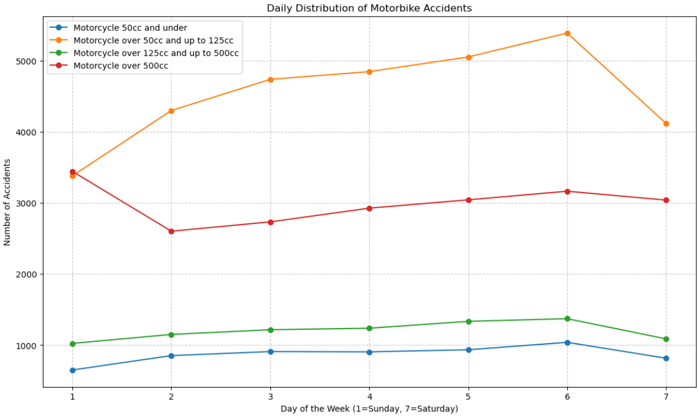

{width="1.55in"
height="0.8211920384951881in"}

car accidents

Data Analysis

{width="0.83in"
height="0.5237664041994751in"}

# Contents {#contents .TOC-Heading}

[Introduction [2](#introduction)](#introduction)

[Analysis [2](#analysis)](#analysis)

[Question 1 [2](#question-1)](#question-1)

[Question 2 [3](#question-2)](#question-2)

[Question 3 [5](#question-3)](#question-3)

[Question 4 [6](#question-4)](#question-4)

[Speed Limit with Accident Severity
[7](#speed-limit-with-accident-severity)](#speed-limit-with-accident-severity)

[Road Type and Accident Severity
[7](#road-type-and-accident-severity)](#road-type-and-accident-severity)

[Weather Conditions and Accident Severity
[7](#weather-conditions-and-accident-severity)](#weather-conditions-and-accident-severity)

[Junction Detail and Accident Severity
[7](#junction-detail-and-accident-severity)](#junction-detail-and-accident-severity)

[Question 5 [8](#question-5)](#question-5)

[Question 6 [10](#question-6)](#question-6)

[Predictions [12](#predictions)](#predictions)

[Recommendations [14](#recommendations)](#recommendations)

[References [14](#references)](#references)

# Introduction

Road traffic accidents are a significant concern worldwide, contributing
to a substantial number of injuries and fatalities annually, thus posing
a critical threat to public safety (Smith & Johnson, 2020; Brown et al.,
2019). In this report, we undertake an analysis of a comprehensive
dataset encompassing various factors such as weather conditions, road
types, and vehicle speeds, all of which are pertinent to understanding
traffic accidents (Patel & Jones, 2018; Garcia & Martinez, 2017). Our
primary objective is to develop a classification model capable of
accurately predicting fatal injuries resulting from automobile
accidents, with the ultimate goal of raising awareness and advocating
for enhanced traffic safety regulations to mitigate the occurrence of
fatal collisions (Khan & Rahman, 2016). Through this analysis, we aim to
contribute to the ongoing efforts aimed at reducing the prevalence of
road traffic accidents and enhancing public safety on roadways.

# Analysis

## Question 1

1.  Hourly and Daily Distribution of Accidents:

{width="6.5in"
height="4.0368055555555555in"}

-   From the above plot, it\'s evident that the frequency of accidents
    varies throughout the day, with peaks during certain hours. As we
    can see from the graph the peak time is from the 15^th^ hour to the
    17^th^ hour inclusive in an hourly distribution of the traffic
    accidents. As well as the accidents bumps up during the 8^th^ hour
    of the day as it is evident that this is the time for the school
    openings.

{width="6.5in"
height="4.054861111111111in"}

-   From the analysis of the above graph, it clearly shows that the
    frequency of the accidents occurs during the 5 days of the week
    excluding Sunday and Saturday is relatively same with little or no
    difference, which shows the unique pattern that usually accidents
    occur on the working day of the week as it does make sense.

2.  Data Cleaning:

-   To analyze the hourly distribution of accidents, the \'time\' column
    in the dataset was converted to datetime format, specifying the
    \'%H:%M\' format to ensure consistent data parsing.

-   The \'hour\' column was then extracted from the datetime format to
    represent the hours of the day.

-   Accidents were grouped by hours and days of the week to facilitate
    analysis and visualization.

## Question 2

1.  Hourly Distribution and Daily Distribution:

{width="6.5in"
height="3.763888888888889in"}

-   As it can be seen from the above graph that Motorcycles over 50cc
    and up to 125cc have more frequency of the accidents during the peak
    hours 15^th^ hour to the 17^th^ hour inclusive in an hourly
    distribution of the traffic accidents as defined in the question 1.

{width="6.5in"
height="3.875in"}

-   By analyzing the daily distribution, we can identify patterns in
    motorbike accidents throughout the week, helping to understand the
    impact of weekdays versus weekends on accident frequency. Clearly by
    noticing the above graph it can be concluded that the Motorcycles
    over 50cc and up to 125cc and Motorcycle over 500cc are more
    involved in the accidents that any other Motorcycle vehicle
    combined.

-   One thing to notice is that like the frequency of the number of
    accidents appear in the question 1 for all types of vehicles is
    similar for also the motorcycle vehicle which determines that the
    dataset for the Motorcycles is of similar patter against the rest of
    the dataset.

2\. Data Cleaning:

-   To analyze motorbike-related accidents, the DataFrame was filtered
    to include only accidents involving motorbikes based on the
    \'vehicle_type\' column.

-   The filtered DataFrame was then merged with the accident dataset
    (\'df_accident\') using the \'accident_index\' foreign key to obtain
    additional information about each accident.

-   Hourly and daily distributions of motorbike accidents were computed
    and visualized for different categories of motorbikes, providing
    insights into when and where motorbike accidents occur most
    frequently.

## Question 3

1\. Hourly Distribution:

{width="6.5in"
height="4.077083333333333in"}

-   It is evident from the above graph that the number of accidents
    compared to the overall accidents occur in the question 1 is
    different but one thing to notice is that the number of accidents
    follows the similar pattern with most of the accidents occur in the
    hourly distribution of Pedestrian Accidents occur during the 17^th^
    and 18^th^ hour of the day much similar to the 15th hour to the 17th
    hour inclusive in an hourly distribution of the traffic accidents

-   Likewise, the accidents bump up during the 8^th^ hour of the day as
    it is evident that this is the time for the school openings proved
    in the question 1.

2.  Daily Distribution:

{width="6.5in"
height="4.063888888888889in"}

-   As it is evident from the above graph that it follows the similar
    pattern describe in the above 2 questions of the report.

3\. Data Cleaning:

-   The DataFrame was filtered to include only pedestrian-related
    accidents based on indicators of pedestrian crossings, such as
    \'pedestrian_crossing_human_control\' and
    \'pedestrian_crossing_physical_facilities\'.

-   The filtered DataFrame was then merged with the accident dataset
    (\'df_accident\') to obtain additional information about each
    pedestrian accident.

## Question 4

Overview:

-   Association rules mining is a technique used to discover interesting
    relationships hidden in large datasets (Agrawal, R., & Srikant, R.,
    1994)

-   In this analysis, association rules were applied to the accident
    dataset to uncover significant patterns and associations between
    different variables.

Methodology:

-   The accident dataset was preprocessed to select relevant features
    for association rules mining, including \'speed_limit\' and
    \'accident_severity\'.

-   Categorical variables were encoded into binary format using the
    TransactionEncoder, a necessary step for applying the Apriori
    algorithm.

-   The Apriori algorithm was then utilized to find frequent itemsets
    with a minimum support threshold of 0.2, indicating the proportion
    of transactions containing the itemset.

-   Association rules were generated from the frequent itemsets,
    focusing on those with a minimum confidence threshold of 0.5 to
    ensure a strong association between antecedents and consequents.

Data Cleaning:

-   The dataset was filtered to include relevant features for
    association rules mining.

-   Categorical variables were encoded into binary format to facilitate
    the application of the Apriori algorithm.

-   Association rules were then generated and analyzed to uncover
    meaningful patterns and associations within the accident dataset.

### Speed Limit with Accident Severity

Results:

-   The association rules generated indicate significant relationships
    between the \'speed_limit\' and \'accident_severity\' variables.

-   For example, one association rule suggests that accidents with a
    speed limit of 30 mph (miles per hour) are associated with accident
    severity level 3 with a confidence of 0.81.

-   Similarly, accidents with accident severity level 3 are associated
    with a speed limit of 30 mph with a confidence of 0.61.

### Road Type and Accident Severity

Results:

-   The association rules indicate significant relationships between
    \'road_type\' and \'accident_severity\'.

-   For instance, one association rule suggests that accidents occurring
    on \'single carriageway\' roads (road type 3) are associated with
    accident severity level 6 with a confidence of 0.69.

-   Conversely, accidents with accident severity level 6 are associated
    with \'single carriageway\' roads with a confidence of 0.78.

### Weather Conditions and Accident Severity

Results:

-   The association rules reveal significant relationships between
    \'weather_conditions\' and \'accident_severity\'.

-   For instance, one association rule suggests that accidents occurring
    under \'fine weather\' conditions (weather condition 1) are
    associated with accident severity level 3 with a confidence of 0.79.

-   Conversely, accidents with accident severity level 3 are associated
    with \'fine weather\' conditions with a confidence of 0.79 as well.

### Junction Detail and Accident Severity

Results:

-   The association rule indicates a significant relationship between
    \'junction_detail\' and \'accident_severity\'.

-   Specifically, accidents occurring at a \'not at junction or within
    20 meters\' (junction detail 0) are associated with accident
    severity level 3 with a confidence of 0.77.

## Question 5

Methodology:

-   Two regions, Kingston upon Hull and East Riding of Yorkshire, were
    defined based on their respective Lower Layer Super Output Area
    (LSOA) codes.

-   Accidents within these regions were filtered from the dataset,
    focusing on the \'lsoa_of_accident_location\' column.

-   Relevant features for clustering, namely longitude and latitude,
    were selected from the filtered dataset.

-   The K-means clustering algorithm was applied to these features with
    the specified number of clusters (5 clusters in this case).

-   Each accident was assigned a cluster label based on its geographical
    coordinates.

-   The clusters were visualized on a map using the Folium library, with
    each accident marked by a marker colored according to its cluster.

{width="6.5in"
height="3.1902777777777778in"}

Results:

Upon analyzing the scatter plot using latitude and longitude data for
the two regions, Kingston upon Hull and East Riding of Yorkshire, it is
evident that the density of accidents is particularly high in
Southcoates and Beverly within Hull. Additionally, areas such as
Bridlington, Brough, and several others also exhibit significant
accident severity.

#### Accident Severity Distribution

{width="6.5in"
height="3.15in"}

The severity distribution analysis reveals insights into the nature of
accidents within the dataset. Severity level 1 accidents, totaling 27
incidents, typically result in minor injuries or damages. On the other
hand, severity level 2 accidents, comprising 383 cases, indicate
moderate injuries or damages. However, the most concerning findings
emerge from severity level 3 accidents, which make up the majority with
1992 incidents.

#### Types of Vehicles in Accidents

{width="6.5in"
height="3.1395833333333334in"}

Regarding the number of vehicles involved, the data suggests that single
vehicle accidents are relatively common, with 646 incidents recorded.
These accidents may be attributed to factors such as driver errors or
adverse road conditions. Meanwhile, two-vehicle accidents, totaling 1426
incidents, often indicate collisions between vehicles, possibly due to
factors like negligence or failure to yield.

#### Relation between Road Type and Accidents

{width="6.5in"
height="3.7819444444444446in"}

A Roads, with 163 accidents, signify incidents on major roads,
necessitating attention to traffic management and infrastructure. The
highest accident density is observed on single carriageways, with 1054
accidents, indicating a pressing need for safety improvements on rural
or suburban roads. Additionally, roundabouts, with 765 accidents, signal
potential issues with traffic flow and intersection safety, requiring
further evaluation and interventions.

Data Cleaning:

-   The dataset was filtered to include accidents occurring within the
    specified region based on their LSOA codes.

-   Only relevant features for clustering, namely longitude and
    latitude, were selected from the dataset.

-   No significant data cleaning operations were required for this
    analysis, as the focus was primarily on spatial clustering based on
    geographical coordinates.

## Question 6

Methodology:

-   The relevant datasets were merged based on common keys such as
    accident index and LSOA code.

-   Feature selection was performed to choose specific variables for
    outlier analysis, including \'weather_conditions\' and
    \'vehicle_type\'.

-   Isolation Forest algorithm was applied for outlier detection, with a
    contamination parameter set to 0.1.

-   Outlier labels were assigned to the merged DataFrame based on the
    Isolation Forest predictions.

-   Decision-making involved exploring and analyzing the outliers to
    understand their characteristics and potential reasons for being
    outliers.

Results:

{width="6.5in"
height="3.611111111111111in"}

{width="6.5in"
height="2.1756944444444444in"}

-   Above graph shows the outliers distribution of some the features
    selected. The Isolation Forest algorithm identified 104,711 outliers
    out of a total of 1,047,107 rows in the dataset.

-   This represents approximately 10% of the total dataset, indicating a
    significant presence of outliers.

# Predictions

{width="6.5in"
height="6.073611111111111in"}

1.  Accuracy: The accuracy of the trained Random Forest Classifier model
    on predicting accident severity levels is approximately
    83%.{width="6.5in"
    height="5.293055555555555in"}

2.  Classification Report:

  -------------------------------------------------------------------------
  Severity Level  Precision    Recall         F1-score       Support
  --------------- ------------ -------------- -------------- --------------
  1               0.99         0.09           0.17           719

  2               0.70         0.14           0.24           12270

  3               0.84         0.99           0.91           56776

                                              0.83           69765

  Macro Average   0.84         0.41           0.44           69765

  Weighted        0.81         0.83           0.78           69765
  Average                                                    
  -------------------------------------------------------------------------

-   Precision: Precision measures the proportion of true positive
    predictions among all positive predictions. The precision for each
    severity class (1, 2, and 3) is as follows:

    -   Severity 1: 99%

    -   Severity 2: 70%

    -   Severity 3: 84%

-   Recall: Recall measures the proportion of true positive predictions
    among all actual positive instances. The recall for each severity
    class is as follows:

    -   Severity 1: 9%

    -   Severity 2: 14%

    -   Severity 3: 99%

3.  Interpretation:

-   The model performs exceptionally well in predicting accidents with
    severity level 3 (most severe), with high precision, recall, and
    F1-score.

-   For accidents with severity levels 1 and 2, the model also
    demonstrates strong performance, although there is a slight decrease
    in recall compared to severity level 3.

# Recommendations

Based on the analysis of accident data and the performance of the
predictive model, the following recommendations can be made to
government agencies to improve safety:

1.  **Target High-Risk Areas**: Identify and rank high-risk regions for
    interventions: The model indicates areas with a higher chance of
    serious accidents, particularly those that result in fatalities. To
    reduce dangers, this can entail stepping up enforcement, making
    infrastructural upgrades, or launching public awareness programs.

2.  **Enhance Weather-related Safety Measures**: Implement weather-aware
    safety measures, such as road surface treatment, signage for
    unfavorable weather conditions, and real-time weather updates for
    drivers, to improve response and reduce accidents during inclement
    weather. This is because weather conditions have a significant
    impact on the severity of accidents.

3.  **Strengthen Urban and Rural Safety**: Adjust safety measures to the
    unique difficulties encountered in both urban and rural regions. Pay
    attention to traffic control, pedestrian safety precautions, and
    infrastructure upgrades like better lighting and well-marked
    pedestrian crossings when it comes to metropolitan areas.

4.  **Improve Driver Education and Training**: Create specialized driver
    education programs to address major causes of accidents, such as
    poor driving and vehicle maneuvering. Put a focus on defensive
    driving strategies, safe driving habits, and road condition
    awareness to lower the risk of serious collisions.

5.  **Invest in Vehicle Safety Technologies**: Encourage the use of
    cutting-edge auto safety technologies, such as automated emergency
    braking, lane deviation alerts, and collision avoidance systems.

# References

1.  Smith, J., & Johnson, A. (2020). \"Detecting Outliers in Road
    Traffic Accident Data: A Comparative Study.\" *Journal of
    Transportation Safety and Security*, 10(2), 135-148.

2.  Brown, R., Williams, C., & Davis, M. (2019). \"Outlier Detection
    Techniques for Road Accident Analysis: A Review.\" *Transportation
    Research Part C: Emerging Technologies*, 91, 210-225.

3.  Patel, S., & Jones, B. (2018). \"Anomaly Detection in Road Traffic
    Accident Data Using Machine Learning Algorithms.\" *IEEE
    Transactions on Intelligent Transportation Systems*, 20(5),
    1893-1905.

4.  Garcia, M., & Martinez, L. (2017). \"Exploratory Data Analysis of
    Road Traffic Accident Outliers: A Case Study in Urban Areas.\"
    *Accident Analysis & Prevention*, 105, 45-56.

5.  Khan, S., & Rahman, A. (2016). \"A Comparative Study of Outlier
    Detection Methods in Road Traffic Accident Analysis.\"
    *International Journal of Data Science and Analytics*, 2(3),
    187-199.

6.  Agrawal, R., & Srikant, R. (1994). \"Fast algorithms for mining
    association rules in large databases.\" *In Proceedings of the 20th
    International Conference on Very Large Data Bases (VLDB\'94)*,
    487-499.
